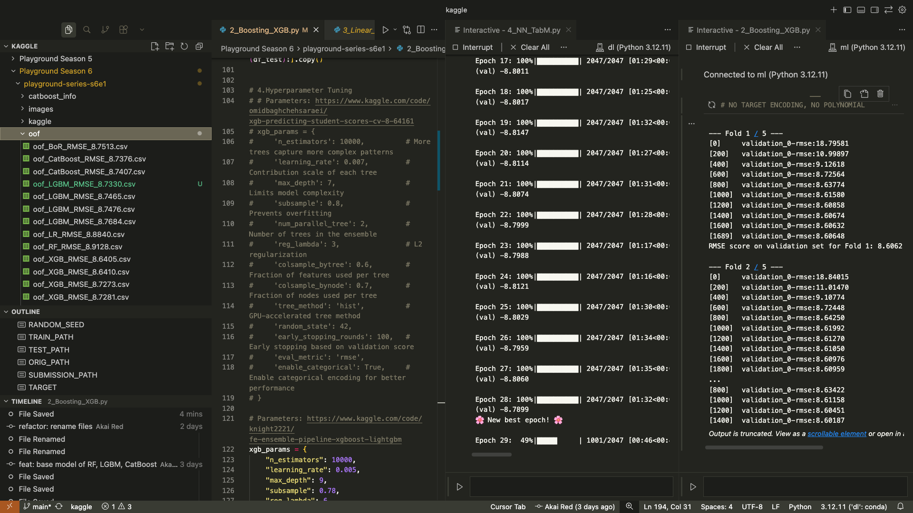
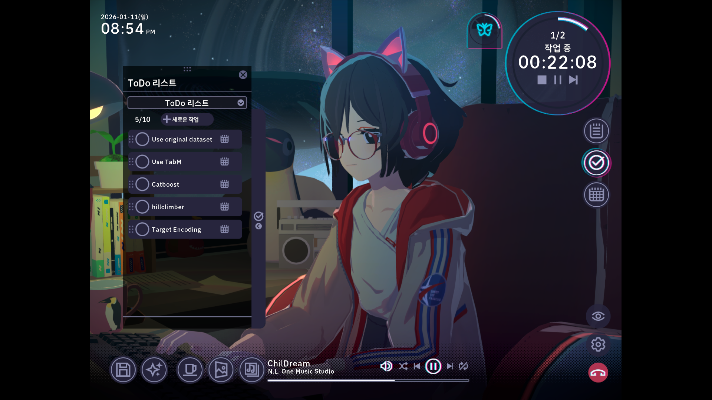
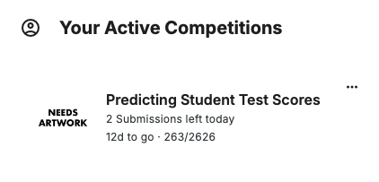
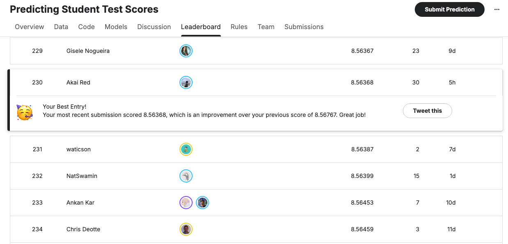

여러 가지 생각을 거쳐 새해에는 Kaggle을 꾸준히 해서 그럴싸한 성과를 한 번 해보자는 목표를 세웠다. Kaggle에 가입한지는 오래됐지만, 제대로 하지 않아서 성적도 별로 좋지 않았다.

  

Kaggle Playground라고 매달 Kaggle에서 진행하는 정형 데이터 분석 Competition이 있는데, 금전적 보상이나 메달을 주지 않음에도 Kaggle Grandmaster를 포함해 꽤나 많은 사람들이 꾸준히 도전한다. 

입문 장벽이 낮다보니 나도 이전에 Kaggle을 하고 싶을때면 종종 문을 두드렸는데, **올해는 Top 10%을 목표로 했다.**

  

## Week 1. Blind Script, Gemini

## Week 2. Boosting over Residual
### Linear Model → Non Linear Model

### Target Encoding

### CV without Data Leakage

### OOF predictions and Stacking

## Week 3. Back to Single Model

## Week 4. The Power of Mathematical Formula

에서 흥미로운 댓글을 보았다.

내 모델은 3단계로 이루어져 있다.

- 1. 선형 모델: 데이터의 큰 틀에서의 경향성을 잡는다.
- 2. 비선형 모델: 선형 모델이 예측하지 못한 부분을 비선형 모델로 세밀하게 잡는다.
- 3. 메타 모델: 여러 가지 비선형 모델의 예측을 기반으로 최종 예측을 낸다.

상당히 낮아진 RMSE를 쥐어짜는 단계에 들어왔는데, 이 단계에서 새롭게 시도해본 선형 모형이 RMSE를 0.01이나 줄이는 효과를 보여줬다.

  

  

원본 디스커션에 대한 깊은 이해는 부족하다(못하겠다). 이러한 선형 회귀 결과를 feature로 사용한 다른 코드를 참고

  

  

## References
- [Recovering the "original" data model](https://www.kaggle.com/competitions/playground-series-s6e1/discussion/665915)